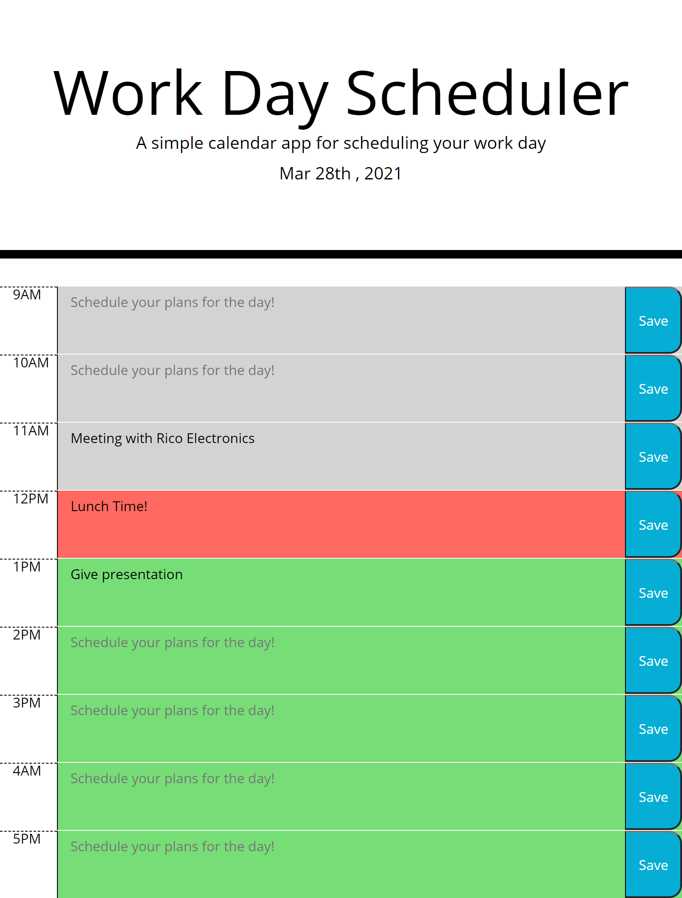

# MyDayPlanner
# by Troy Freed
<h1> Contact Info : </h1>

 tfreedwebdev94@gmail.com 
 

<h2> Homework description </h2>

 This homework assignment was designed around using Jquery to dynamically update HTML and CSS. This application diplays time at the top of the page by using the moment.js API and allows the user to schedule any plans they have during the day for that specific hour of the day. Those created plans will be saved to the local storage so that when the user closes the app or refreshes the page then the data will persist on the page. The text areas for each column will also change colors based on the time of the day. Grey being past, red being present, and green being future. 

<h2> Technologies Used </h2>
    * HTML
    * CSS
    * Bootstrap
    * Javascript
    * Jquery
    * Moment.js API
    
# Screenshots

(https://tfreed94.github.io/MyDayPlanner/)